# Монгол үгийн алдаа шалгах толь
## Бүтээлийн тухай

## Ашиглах заавар
Уг толь нь [hunspell](http://hunspell.github.io/) алдаа шалгагчийн 1.3.3-аас хойших хувилбаруудад зориулагдан бүтээгдсэн. [Firefox](https://www.mozilla.org/en-US/firefox/new/) болон [LibreOffice](https://www.libreoffice.org/) дээр түгээмэл ашиглагдаж байгаа хэдий ч hunspell дэмждэг дурын программд энэхүү толийг ашиглаж боломжтой. Hunspell дэмжигддэг программуудын заримаас дурдвал:
1. .NET
1. Chrome
1. Chromium
1. Emacs
1. Firefox
1. gedit
1. Illustrator
1. InDesign
1. Inkscape
1. JetBrains editors (IntelliJ IDEA, PyCharm, CLion, WebStorm, TeXiFy IDEA, ….)
1. Kile
1. LibreOffice
1. LyX
1. Notepad++
1. OpenOffice
1. Opera
1. QuarkXPress
1. Scribus
1. SDL Trados
1. Sublime Text
1. Texmaker
1. TeXnicCenter
1. TeXstudio
1. TeXworks
1. WinShell

### Firefox интернет хөтөч дээр ашиглах

1. [firefox.com](https://firefox.com) хаягаар хандаж интернет хөтчөө татаж авч суулгана.
1. Үүний дараа алдаа шалгах толио татаж авна. Ингэхдээ дараах 2 төрлийн аргын аль нэгийг ашиглаарай:
   1. [https://addons.mozilla.org/en-US/firefox/addon/dict-mn/](https://addons.mozilla.org/en-US/firefox/addon/dict-mn/) хаягаар хандах
   1. Эсвэл хөтчийнхөө `Add-ons` цэсийг сонгоод хайх талбарт `монгол` хэмээн бичиж хайгаарай
   \
   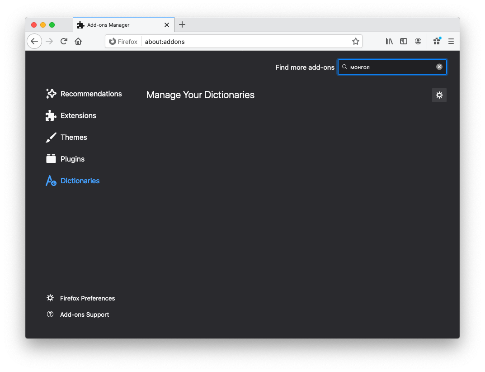

1. Ийнхүү нээгдэх хуудаснаас `+ Add to Firefox` гэсэн товчлуурыг дарж суулгах хүсэлт илгээнэ.
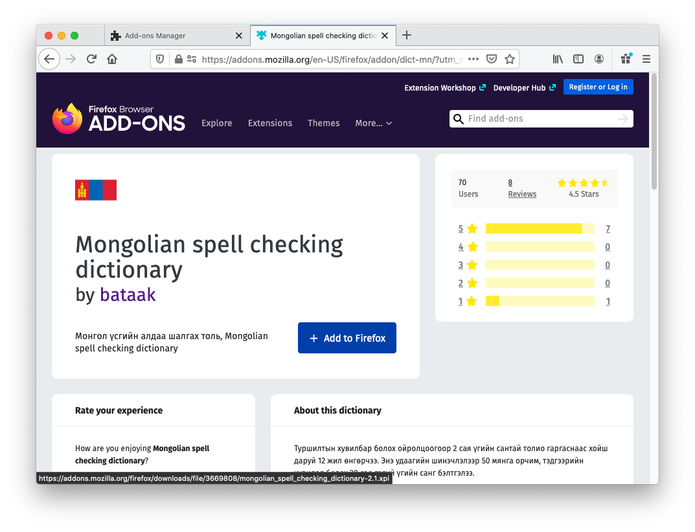

1. Ингэхэд хөтчийн дээд талд гарч ирэх жижиг цонхноос `Add` гэсэн товчийг дарж суулгана.
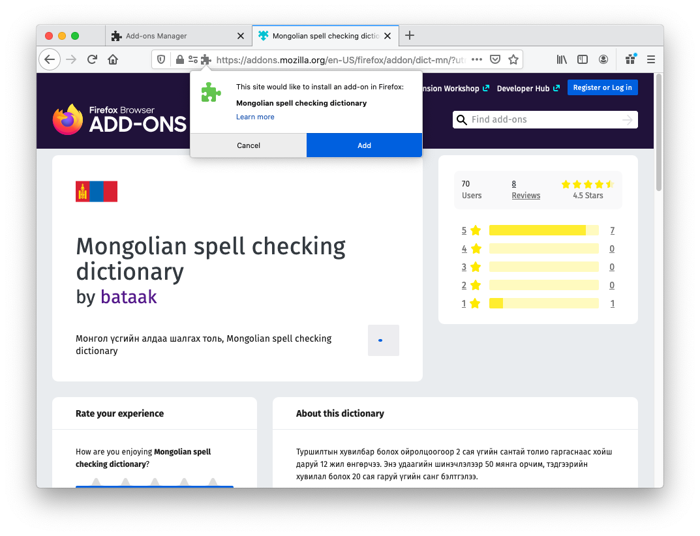

1. Ийнхүү ашиглахад бэлэн боллоо.
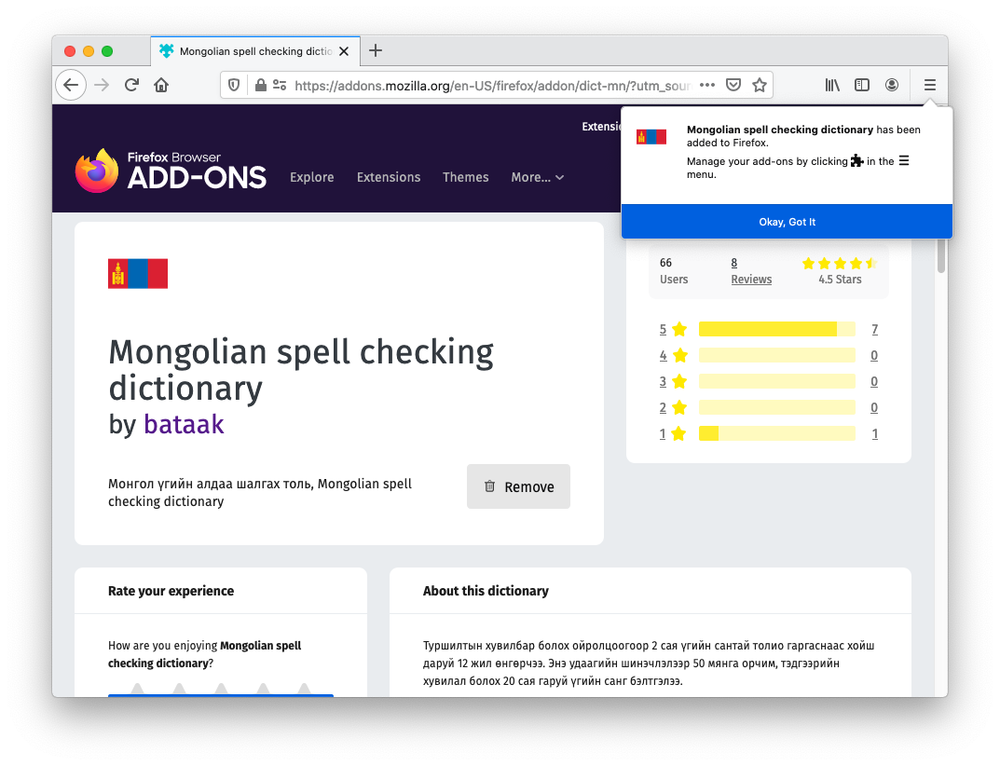

1. Одоо бичих талбарт оруулсан бичвэрийн тань алдаа шалгагдах болно.
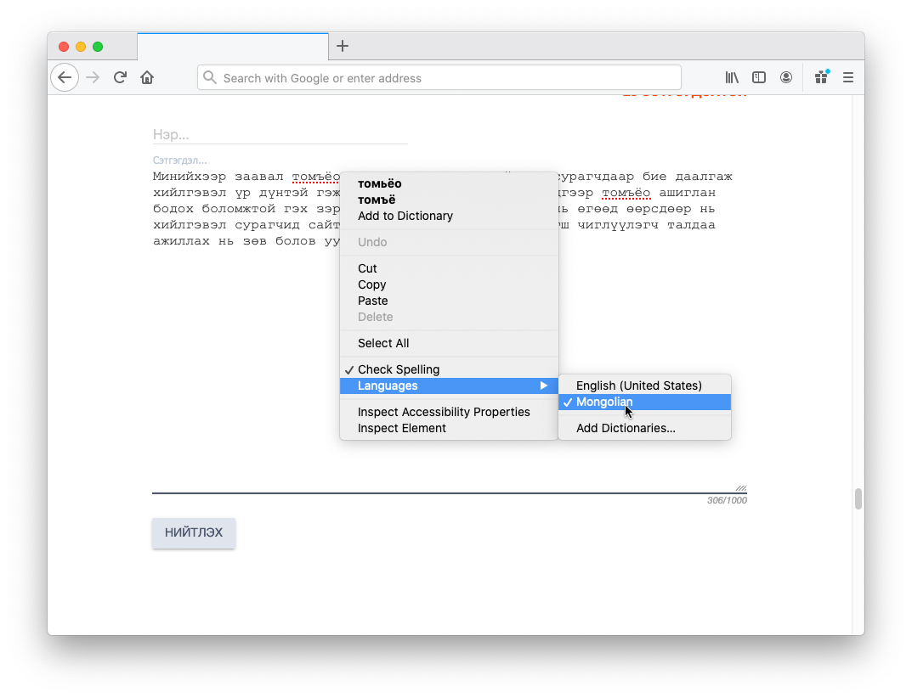

### LibreOffice баримт бичиг боловсруулагч дээр ашиглах

1. [https://www.libreoffice.org](https://www.libreoffice.org/download/) хаяг уруу орж программаа татаж авч суулгана.
1. Үүний дараа [dict-mn.oxt](https://github.com/bataak/dict-mn/raw/main/extension%20-%20LibreOffice/dict-mn.oxt) файлаа татаж авна.
1. Татаж авсан файлаа ажиллуулж, суулгана.
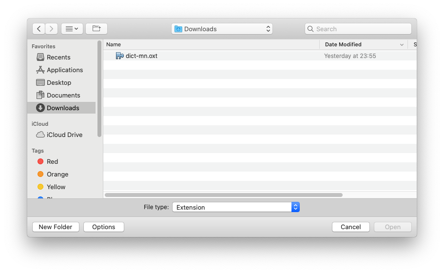\
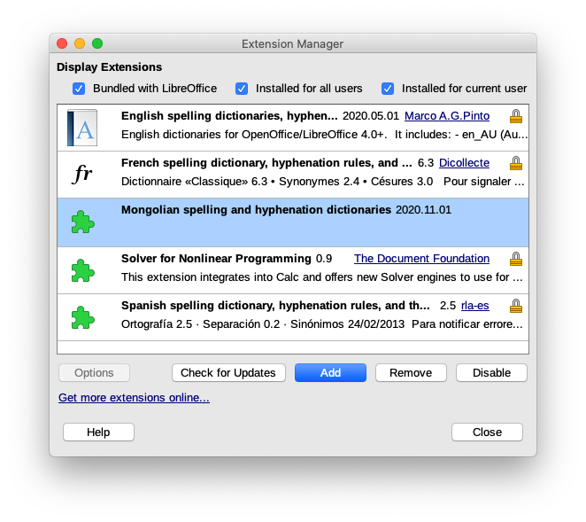

1. Суулгасны дараа `Close` товчийг дараад `Restart Now` товчийг бас дарж программаа дахин эхлүүлээрэй.
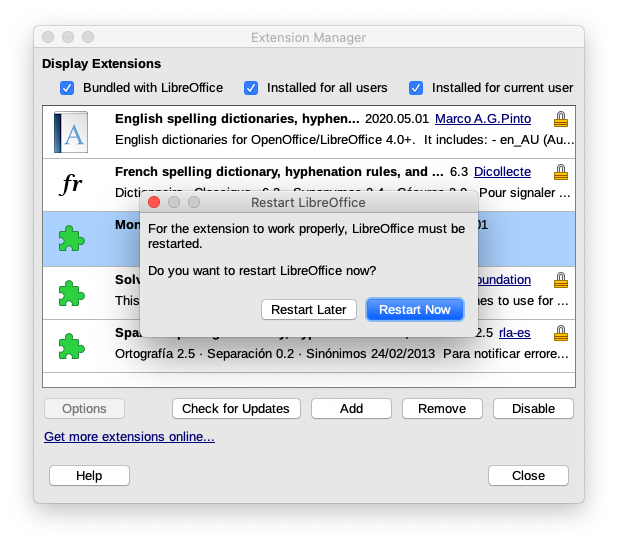

1. Ийнхүү программ дахин нээгдэх үед `Writer Document` товчийг сонгоно
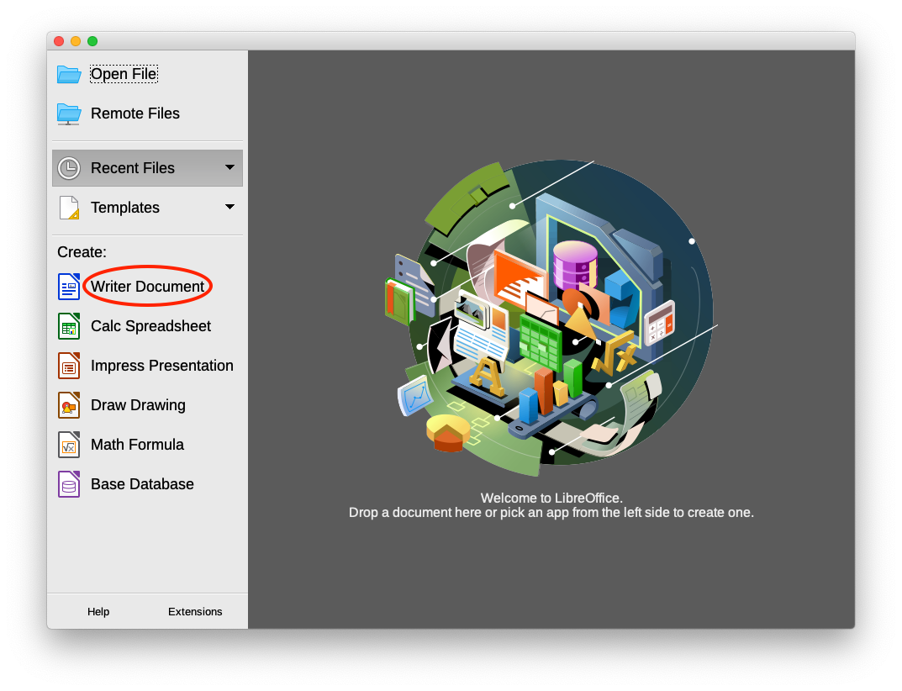

1. Монгол үгийн алдаа шалгагчийг үндсэн шалгагч болгохын тулд 
   1. `LibreOffice > Preferences...` (Windows үйлдлийн систем бол `Tools > Options...`) цэсийг сонгоод 
   1. Доорх зурагт үзүүлсэнчлэн `Language Settings > Languages` гэж ороод 
   1. `Default Languages for Documents` дотор `Western: Mongolian Cyrillic` гэж сонгоод 
   1. `OK` товчийг дарна
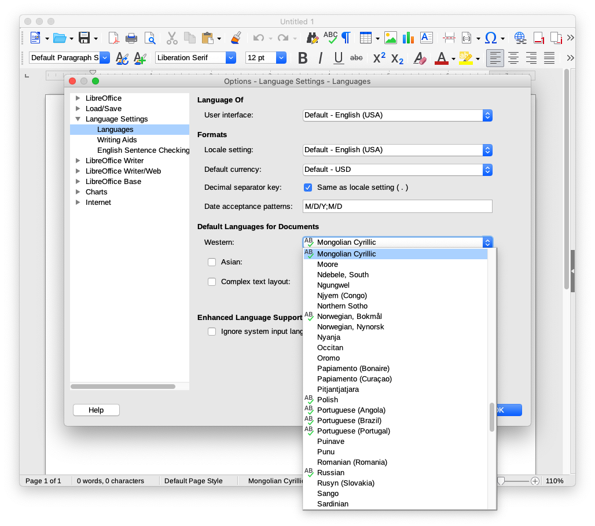

1. Ийнхүү ашиглахад бэлэн боллоо.

#### LibreOffice тольд шинэ үг нэмэх
LibreOffice 6.0 хувилбараас эхлэн хэрэглэгч тольд шинэ үндэс үгийг залгаврын хамтаар оруулах боломжтой болсон юм. Үүнийг хэрхэн хийхийг үзүүлье.

1. Алдаатай үг дээр хулганынхаа баруун товчийг дарж жижиг цонхыг нээнэ. Улмаар `Spelling...` гэдгийг сонгоно.
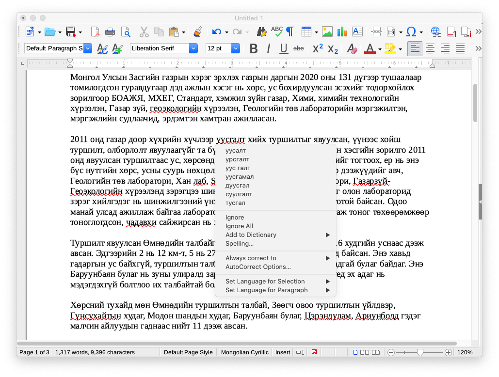

1. Нээгдэх жижиг цонхноос `Options...` товчийг дарж дахин жижиг цонх нээнэ
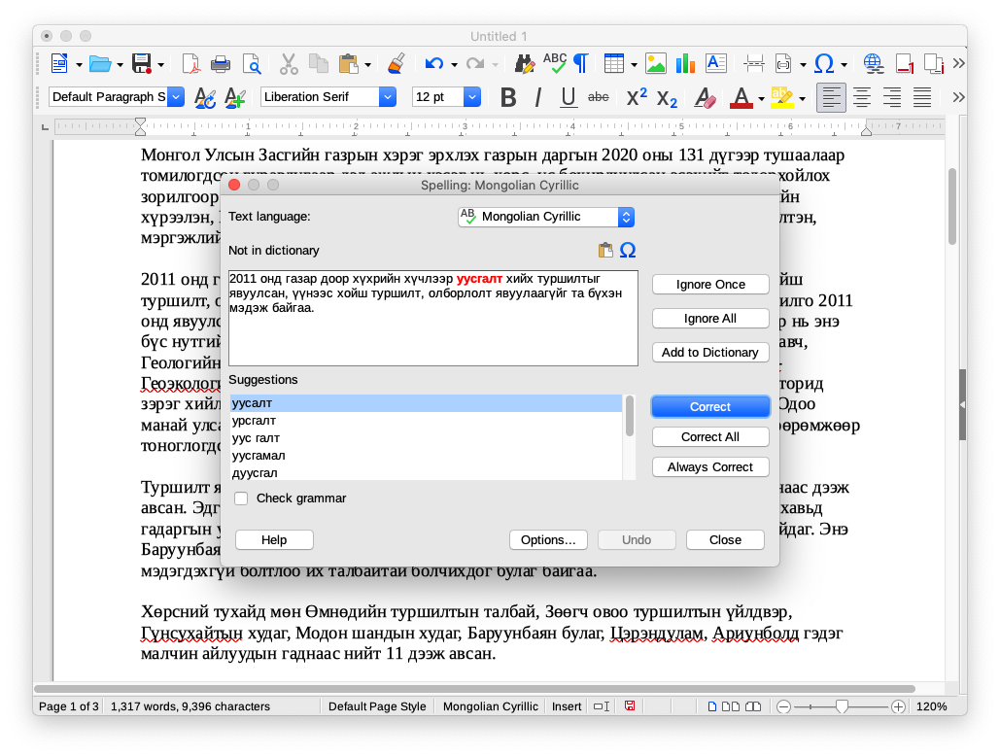

1. Одоо `New` товчийг дарж шинэ толь үүсгэнэ
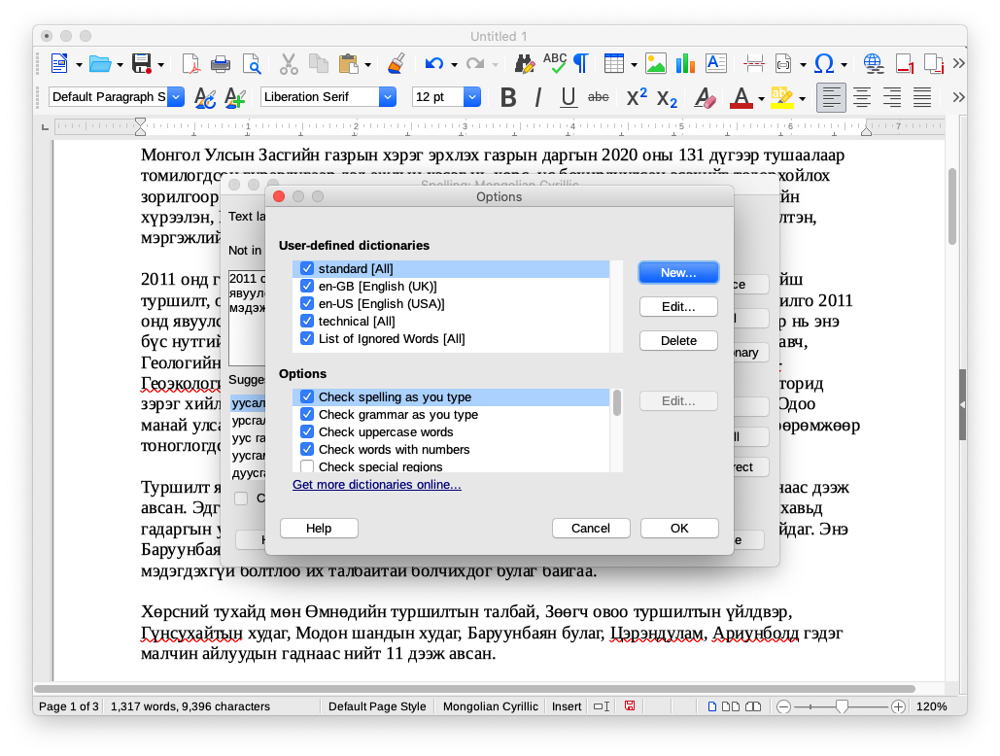

1. `Name` гэдэгт дурын нэр өгнө, `Language` гэдэгт `Mongolian Cyrillic` гэж сонгоод `OK` товч дараад сая үүсгэсэн толио `Edit` хийнэ
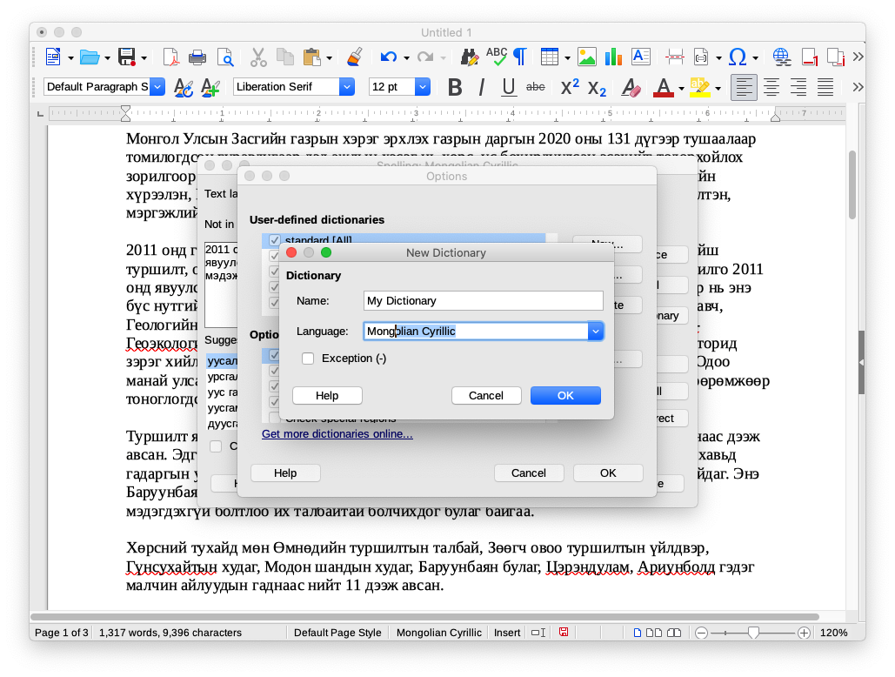

1. Нээгдэх цонхны `Word` нүдэнд оруулахыг хүссэн үгийн үндсийг (хэрэв үйл үг бол үйлт нэрийн "х"-гүй төлөвийг оруулна: `оруул`, ~~`оруулах`~~, `оруулчих`), `Grammar By` нүдэнд тольд буй гэхдээ оруулах үгтэй хувилал төстэй үгийг бичнэ
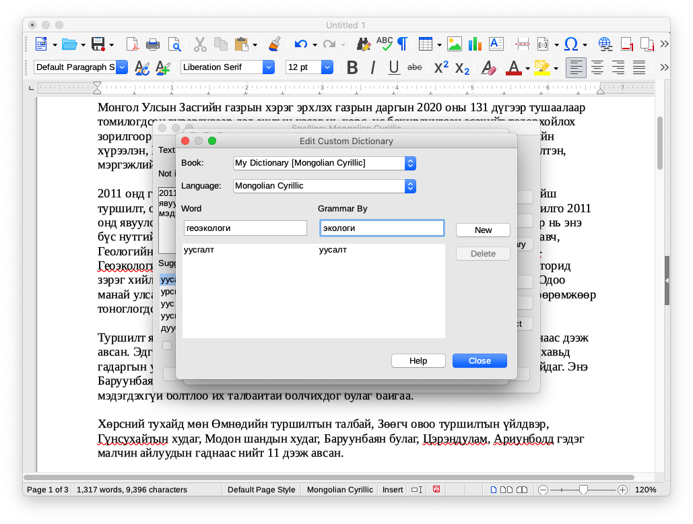

1. Дээрх жишээнд `уусгалт` нь `уусалт`, `геоэкологи` нь `экологи` хэмээх үгүүдтэй хувиллын хувьд дүйх юм. Ийнхүү `уусгалт` гэсэн үгийн бүх хувиллууд (`уусгалтын`, `уусгалтыг`, `уусгалтад`, ...) тольд орлоо.

### Sublime Text код засварлагч дээр ашиглах
1. [sublimetext.com](https://www.sublimetext.com/) татан авч суулгана.
1. `Sublime`-д зориулсан толио татаж [эндээс](https://github.com/bataak/dict-mn/raw/main/package%20-%20Sublime%20Text/Language%20-%20Mongolian.sublime-package) татаж аваарай.
1. Хэрэв таны үйлдлийн систем `Windows` бол 
### Nodepad++ код засварлагч дээр ашиглах
### TeXstudio ЛаТеХ засварлагч дээр ашиглах
1. TeXstudio программаа татаж аваад суулгана.

1. Толио [эндээс](https://github.com/bataak/dict-mn/raw/main/mn_MN.zip) татаж аваад дурын газраа задална (хавтас үүсгэн).

1. Программаа нээгээд `Preferences... > Language Checking` гэж ороод `Spelling Dictionary Directories:` гэдэгт задалж хуулсан хавтсаа зааж өгөөд `Default Language` гэдэгт `mn_MN` гэдгийг сонгож өгнө.
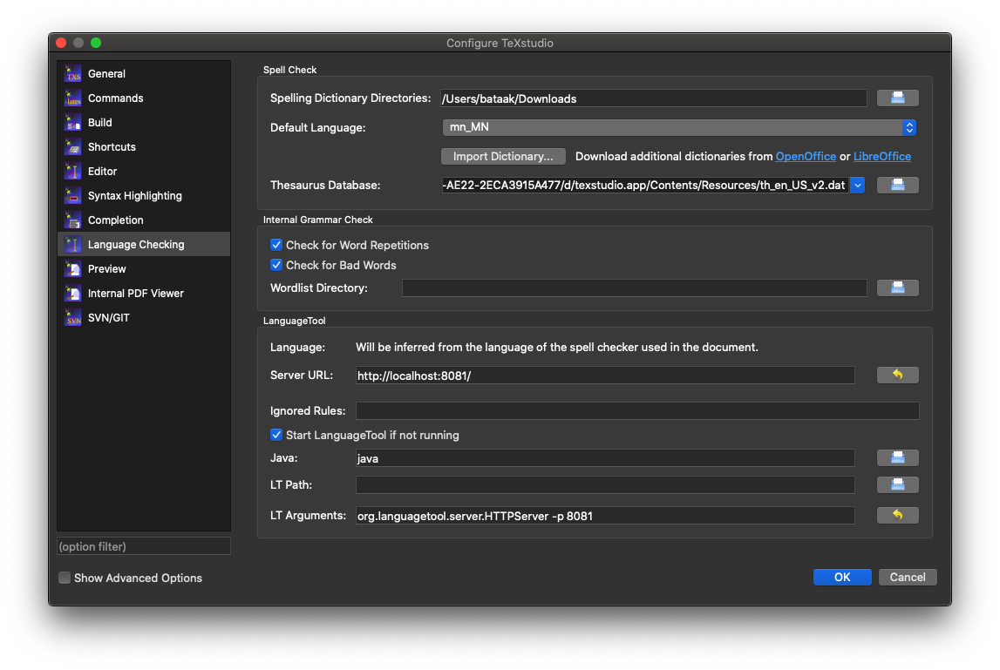

1. Ийнхүү ашиглахад бэлэн болов.
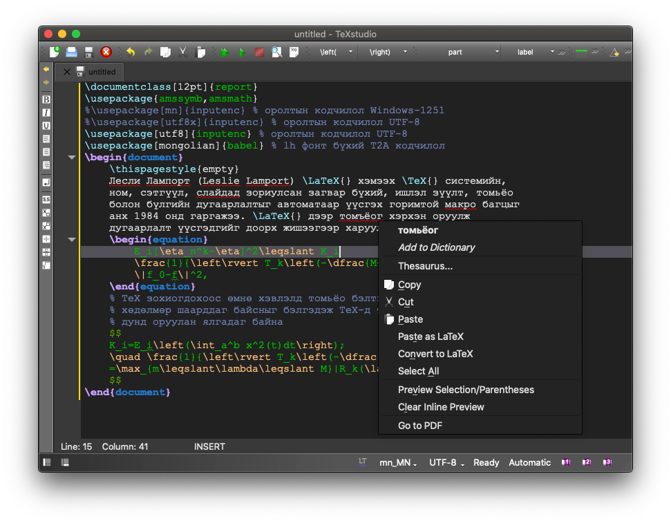
