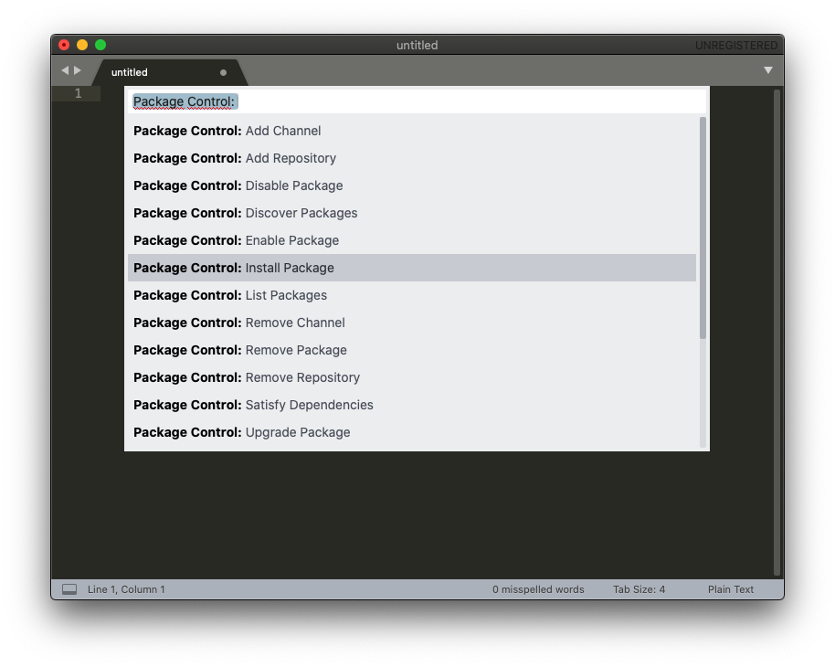
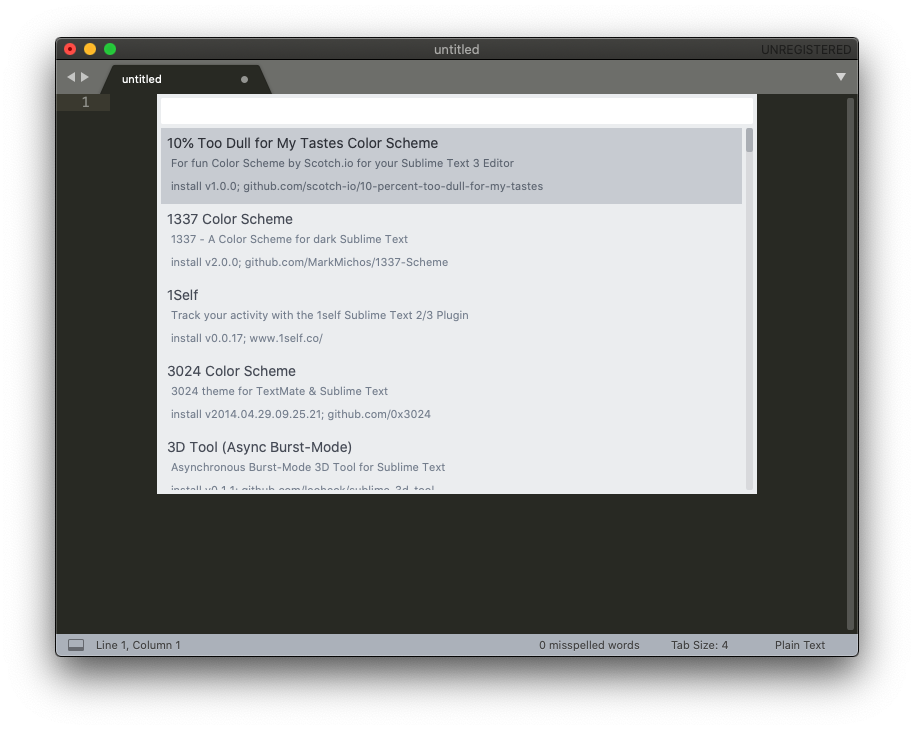

## Бүтээлийн тухай

Энэхүү толь нь 36 мянга орчим үндэс үгтэй бөгөөд түүний 92% нь үйл үг, үлдэх хэсэг нь жинхэнэ нэр, тэмдэг нэр, оноосон нэр (газар ус, хүний нэр) болон сул үг болно. Үйл үгсийн хэв болон байдлын нөхцөлийг оролцуулаад 348,000 орчим үгсээс нийтдээ 200 сая гаруй үгийн хувилал үүсгэж байгаа юм.

<iframe min-width="100%" min-height="100%" width="auto" height="auto" src="https://www.youtube.com/embed/N-oRV9TlYrA" frameborder="0" allow="accelerometer; autoplay; clipboard-write; encrypted-media; gyroscope; picture-in-picture" allowfullscreen></iframe>

Монгол үгийн алдаа шалгах толийг 2001 оноос эхлэн дараах толиудыг ашиглан хөгжүүлж ирлээ:
1. Монгол хэлний товч тайлбар толь
2. Монгол бичгийн хадмал толь
3. Монгол хэлний хадмал толь
4. Монгол үсгийн дүрмийн толь
5. Монгол хэлний их тайлбар толь
6. Монгол хэлний зөв бичих дүрмийн журамласан толь

Толиудын үгийн тоо | Үндэс үгийн тоо | Хэв/байдлын нөхцөлтэйгөөр
------------- | ------------- | -------------
Монгол хэлний товч тайлбар толь | 17,000 | 30,000
Монгол үсгийн дүрмийн толь | 18,000 | 31,000
Монгол бичгийн хадмал толь | 31,600 | 34,400
Монгол хэлний хадмал толь | 45,800 | 50,000
Монгол хэлний их тайлбар толь | 48,000 | 52,400 (≈60,000)
Монгол хэлний зөв бичих дүрмийн журамласан толь | 31,100 (≈38,000) | 56,000
Монгол үгийн алдаа шалгах толь | 36,500 | 348,500

≈ ижил бичлэгтэй ондоо утгатай болон давхцаж орсон үгс

Тольд зөвхөн түгээмэл ашиглагддаг гадаад (орос, хятад, төвөд, санскрит) үгсийг оруулсан болно.

1. [Firefox интернет хөтөч дээр ашиглах](#firefox)
1. [LibreOffice баримт бичиг боловсруулагч дээр ашиглах](#libreoffice)
1.    1. [LibreOffice тольд шинэ үг нэмэх](#libreoffice-dic)
1. [Sublime Text код засварлагч дээр ашиглах](#sublime)
1. [TeXstudio засварлагч дээр ашиглах](#texstudio)

### Тольд орсон зарим үгсийн бичлэгийн талаар

Энэхүү толийн үгийн санг бүрдүүлэхдээ кирилл үсгийн дүрмээс гадна уламжлал баримтлах зарчим, үндэс үгийн үнэн зөв задаргаа болон орчин цагийн монгол хэлний авиазүйн зарчим зэргийг харгалзсан болно. Толь бичгүүдэд (жишээлбэл журамласан толь) буй зарим үгийн алдааг дараах байдлаар засаж орууллаа.

Журамласан толь | Зассан хувилбар | Тайлбар
------------- | ------------- | -------------
албажхаар | албажихаар | үйлт нэрийн "-х" эгшигтэй байна. Энэхүү алдаатай хувилал нь ижил төст бусад үгсийн хувьд мөн давтагдан оржээ.
араншингийн, жомшингийн, мөрөгшингийн, ногоолингийн, цөмлингийн, шаргалингийн, шимэлзэнгийн, шуумангийн | араншны, жомшны, мөрөгшний, ногоолины, цөмлиний, шаргалины, шимэлзний, шуумны | уламжлалт бичлэг нь инхлэг "н" үгүй
баарагна, гоншигно, гоншигнуур, гуншгина, гуншгинуур, дусагна, елхэгнүүр, марагна, хавжгануур | бааргана, гоншгоно, гоншгонуур, гуншгана, гуншгануур, дусгана, елхгэнүүр, маргана, хавжигнуур | нэрээс үйл үг үүсгэх -на үгүй, харин нэрээс үйл үг үүсгэх -гана, -чигна-, -жигна- дагавар буй
вирусний | вирусийн | хатуу дэвсгэрээр төгссөн ерөнхий нэр
давхцлыг | давхцалыг | 9 + 9 + э
дунджил, зурвасла, цавчдасла, чавхдасла | дундажла, зурвасал, цавчдасал, чавхдасал | Эгшигт гийгүүлэгчээр төгссөн үгэнд –л дагаврыг залгахдаа зохих балархай эгшгийг ард нь бичнэ. -л дагаврыг залгахад заримдаг гийгүүлэгчийн өмнөх балархай эгшиг гээгдэхээргүй байвал -л дагаврын шаардагдах эгшгийг өмнө нь бичнэ.
дэгдээхэй, сэвхэлдэй, сэгэлдэй, цэгцүүхэй, шийхнүүхэй, шишүүхэй | дэгдээхий, сэвхэлдий, цэгцүүхий, шийхнүүхий, шишүүхий | Энэ талаар эрдэмтэн Ц. Дамдинсүрэн тольдоо дурдахдаа: Дэлхий, мэлхий, ээзгий, эсгий гэхэд цөм ий дагавартай байна. Гэтэл дэгдээхэй, эрвээхэй гэж эй дагавартай хэлдэг нь гажилт мөн тул үүнийг хэрэгсэхгүй, дэгдээхий, эрвээхий гэж бичлээ.
мөлхөлхийлөх | мөлхөлхийлэх | алхалхийлэх, заналхийлэх гэх ижил төст үгс бий
номхотго, номхотгол, цомхотго, цомхотгол, ширхэт, шүлхэт, эмхэтгэ, эмхэтгэл | номхтго, номхтгол, цомхтго, цомхтгол, ширхт, шүлхт, эмхт, эмхтгэл | уламжлалт бичлэгээрээ номхт гэдгийн т нь хатуу бөгөөд (сэтгэл гэдгийн т) үүнийг зарим эрдэмтэд угтаа д нь ондоошоод т болсон тул д өмнөө эгшиг авна хэмээн үздэг. Гэвч нэгэнт т үсгээр тэмдэглэсэн бол сх-ийн дараах тч эгшиггүй орно хэмээх дүрэмд захирагдана.
ноогдол | ногдол | олон хувилбар байх шаардлагагүй
утасд | утаст | Эрдэмтэн Ц. Дамдинсүрэн өөрийн зохиосон толь бичгийн өмнөх үгт энэ талаар ийн дурджээ: ... Үсгийн дүрэмд энд тэнд тархмал байсан буюу балархай байсан зүйлийг тодруулаад "Зарим дагаврыг бичих дүрэм" гэж нэрлээд нэгтгэж цэгцлэн бичив. Үүнд жишээг хэлбэл: сонстох, утастах буюу сонсдох, утасдах гэж хоёр янзаар бичиж байсныг нэгтгэж сонстох, утастах гэж бичихээр дүрэмдээ оруулав.
үнсэлт | үнэсэлт | үнс нурам, үнэсэх үнэрлэх
сэлмийн, тугалганы, чононы | сэлэмний, тугалгын, чонын |
түвшин | төвшин | Энэ талаар эрдэмтэн Ц. Дамдинсүрэн тольдоо ийн дурджээ: Шагжи, "Монгол үсүг-үн дүрэм-үн толи бичиг" 1937 онд хэвлэгдсэн, 27 мянга орчим үгийг багтаажээ. О, У, Ө, Ү, Д, Т, Х, Г зэрэг үсгийг ялгаж тодруулан үсгийн дэс дараагаар жагсаасан нь Монгол бичгийн судлалын чухал ололт юм. Манай Халхын Ө-гөөр дууддаг нэлээд үгийг Ү-гээр бичсэн онцлог энэ толинд бий. Жишээ нь: төлөвийг-түлэв, төвгийг-түвэг, өмхийг-үмхий, төвшинг-түвшин, өвтэгшийг-үвтэгш гэх мэт.
шавширах | шавшрах | 7 + 9 - э
шарийнаас | шарийгаас | 
руу | уруу | Сул баймжийг саланги бичих дүрэм: Дагавар үг уруу гэж бичихдээ эгшиг зохицуулахгүй, эхний эгшгийг хасахгүй, эр, эм ямар ч үгэнд уруу хэвээр нь бичнэ. Жишээлбэл: уул уруу (уул өөд гэдэгтэй адил), гэр уруу (гэр өөд гэдэгтэй адил), гол уруу, өрөө уруу гэх мэт. Уул руу, гэр лүү гэж бичихгүй. 
сэнтэгнэ | ~~сэнтэгнэ~~ | нэрээс үйл үг үүсгэх -на дагавар үгүй тул хасав
манг- | ~~манг-~~ | доромж үгс тул хасав

## Ашиглах заавар

Уг толь нь юникод (UTF-8) стандартад нийцүүлэн бүтээгдсэн тул толийг ашиглахдаа Windows/Mac OS/Linux үйлдлийн системүүдэд дагалдаж ирэх **монгол кирилл үсгийн гарын үндсэн драйверыг ашиглахыг зөвлөж байна**.

Учир нь гарын үндсэн бус зарим драйверууд хэдийгээр юникод стандартыг хангах боловч `өүйё` үсгүүдийн кодууд нь тогтсон стандартаас зөрөөтэй байдаг тул таны оруулсан үг зөв мэт харагдах авч алдаанд тооцогдох болно.

```
Уг толь нь hunspell алдаа шалгагчийн 1.3.3-аас хойших хувилбаруудад ажиллана.
```

[Firefox](https://www.mozilla.org/en-US/firefox/new/) болон [LibreOffice](https://www.libreoffice.org/) дээр түгээмэл ашиглагдаж байгаа төдийгүй [hunspell](http://hunspell.github.io/) дэмждэг дурын программд энэхүү толийг ашиглаж боломжтой. Hunspell дэмждэг зарим программаас дурдвал:
1. .NET
1. Chrome
1. Chromium
1. Emacs
1. Firefox
1. gedit
1. Illustrator
1. InDesign
1. Inkscape
1. JetBrains editors (IntelliJ IDEA, PyCharm, CLion, WebStorm, TeXiFy IDEA, ….)
1. Kile
1. LibreOffice
1. LyX
1. Notepad++
1. OpenOffice
1. Opera
1. QuarkXPress
1. Scribus
1. SDL Trados
1. Sublime Text
1. Texmaker
1. TeXnicCenter
1. TeXstudio
1. TeXworks
1. WinShell

Интернет хөтөч болох `Firefox`, баримт боловсруулагч `LibreOffice`, код засварлагч `Sublime Text` болон LaTeX файл засварлагч `TeXstudio` программуудад энэхүү толийг хэрхэн ашиглахыг үзүүлье.

### Firefox интернет хөтөч дээр ашиглах <a name="firefox"></a>

1. [firefox.com](https://firefox.com) хаягаар хандаж интернет хөтчөө татан авч суулгана.

1. Үүний дараа алдаа шалгах толио татаж авна. Ингэхдээ дараах 2 төрлийн аргын аль нэгийг ашиглаарай:
   1. [https://addons.mozilla.org/en-US/firefox/addon/dict-mn/](https://addons.mozilla.org/en-US/firefox/addon/dict-mn/) хаягаар хандах
   1. Эсвэл хөтчийнхөө `Add-ons` цэсийг сонгоод хайх талбарт `монгол` хэмээн бичиж хайгаарай\
   \
   

1. Ийнхүү нээгдэх хуудаснаас `+ Add to Firefox` гэсэн товчлуурыг дарж суулгах хүсэлт илгээнэ.\


1. Ингэхэд хөтчийн дээд талд гарч ирэх жижиг цонхноос `Add` гэсэн товчийг дарж суулгана.\


1. Ийнхүү ашиглахад бэлэн боллоо.\


1. Одоо бичих талбарт оруулсан бичвэрийн тань алдаа шалгагдах болно.\


### LibreOffice баримт бичиг боловсруулагч дээр ашиглах <a name="libreoffice"></a>

1. [https://www.libreoffice.org](https://www.libreoffice.org/download/) хаяг уруу орж программаа татаж авч суулгана.

1. Үүний дараа [dict-mn.oxt](https://extensions.libreoffice.org/en/extensions/show/1980) файлаа татаж авна. Эсвэл 
   1. `Tools > Extension Manager...` гэж ороод 
   1. нээгдэх жижиг цонхноос `Get more extensions online...` гэснийг сонгоод 
   1. нээгдэх хуудаснаас `mongolian` хэмээн хайж толио татаж авна.

1. Татаж авсан файлаа ажиллуулж, суулгана.\
\


1. Суулгасны дараа `Close` товчийг дараад `Restart Now` товчийг бас дарж программаа дахин эхлүүлээрэй.\


1. Ийнхүү программ дахин нээгдэх үед `Writer Document` товчийг сонгоно\


1. Монгол үгийн алдаа шалгагчийг үндсэн шалгагч болгохын тулд
   1. `LibreOffice > Preferences...` (Mac OS) эсвэл `Tools > Options...` (Windows) цэсийг сонгоод 
   1. Доорх зурагт үзүүлсэнчлэн `Language Settings > Languages` гэж ороод 
   1. `Default Languages for Documents` дотор `Western: Mongolian Cyrillic` гэж сонгоод 
   1. `OK` товчийг дарна\


1. Ийнхүү ашиглахад бэлэн боллоо.

#### LibreOffice тольд шинэ үг нэмэх <a name="libreoffice-dic"></a>

LibreOffice 6.0 хувилбараас эхлэн хэрэглэгч тольд шинэ үндэс үгийг хувиллын хамтаар оруулах боломжтой болсон юм. Үүнийг хэрхэн хийхийг үзүүлье.

1. Алдаатай үг дээр хулганынхаа баруун товчийг дарж жижиг цонхыг нээнэ. Уг жижиг цонхноос `Spelling...` гэдгийг сонгоно.\


1. Улмаар нээгдэх жижиг цонхноос `Options...` товчийг дарж дахин жижиг цонх нээнэ\


1. Одоо `New` товчийг дарж шинэ толь үүсгэнэ\


1. `Name` гэдэгт дурын нэр өгнө, `Language` гэдэгт `Mongolian Cyrillic` гэж сонгоод `OK` товч дараад сая үүсгэсэн толио `Edit` хийнэ\


1. Нээгдэх цонхны `Word` нүдэнд оруулахыг хүссэн үгийн үндсийг (хэрэв үйл үг бол үйлт нэрийн "х"-гүй төлөвийг оруулна: `оруул`, ~~`оруулах`~~, `оруулчих`), `Grammar By` нүдэнд тольд буй гэхдээ оруулах үгтэй хувилал төстэй үгийг бичнэ\


1. Дээрх жишээнд `уусгалт` нь `уусалт`, `геоэкологи` нь `экологи` хэмээх үгүүдтэй хувиллын хувьд дүйх юм. Ийнхүү `уусгалт` гэсэн үгийн бүх хувиллууд (`уусгалтын`, `уусгалтыг`, `уусгалтад`, ...) тольд орлоо.

### Sublime Text код засварлагч дээр ашиглах <a name="sublime"></a>

1. [Sublime Text](https://www.sublimetext.com/) татан авч суулгана.

1. `Command-Shift-P` (Mac OS) эсвэл `Ctrl-Shift-P` (Windows) дараад `Command Palette` нээгээд `Install Package` сонгоно.\


1. Хэсэг хугацааны дараа жижиг цонх дахин нээгдмэгц түүн дотор `mongolian dictionary` гэж бичиж `Enter` дараад толио суулгана.\


1. Ийнхүү ашиглахад бэлэн боллоо.\


### TeXstudio засварлагч дээр ашиглах <a name="texstudio"></a>

1. [TeXstudio](https://www.texstudio.org/) программаа татаж аваад суулгана.

1. Толио [эндээс](https://github.com/bataak/dict-mn/raw/main/mn_MN.zip) татаж аваад дурын газраа шинэ хавтас үүсгэн задална.

1. Программаа нээгээд `Preferences... > Language Checking` (Mac OS) эсвэл `Tools > Options` (Windows) гэж ороод
1. `Spelling Dictionary Directories:` гэдэгт задалж хуулсан хавтсаа зааж өгөөд
1. `Default Language` гэдэгт `mn_MN` гэдгийг сонгож өгнө.\


1. Ийнхүү ашиглахад бэлэн болов.\

